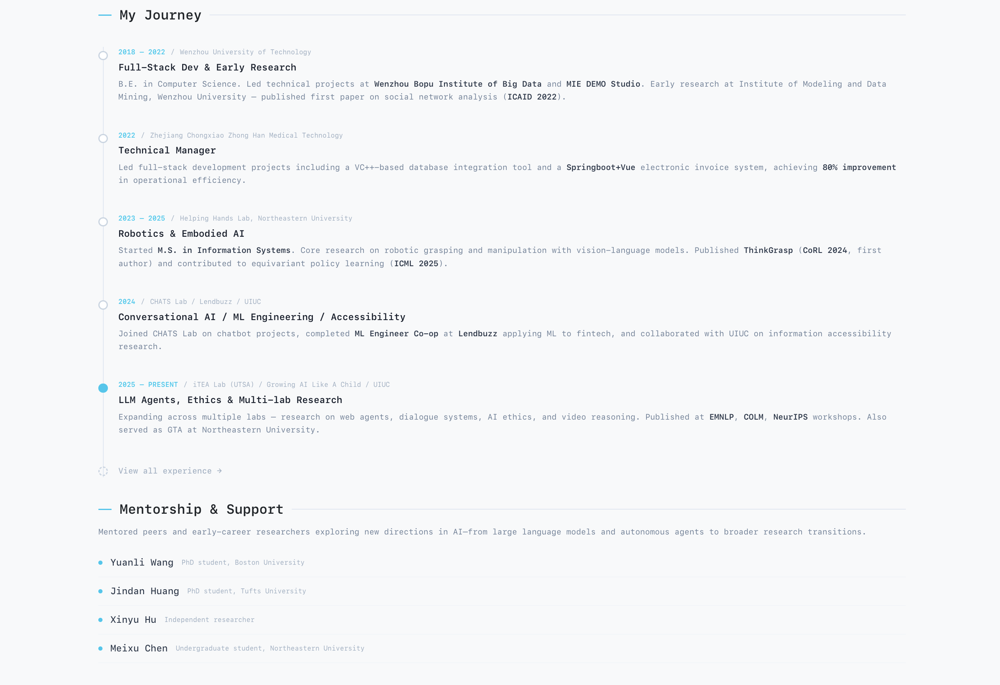

<!--
SPDX-FileCopyrightText: 2026 Yaoyao(Freax) Qian <limyoonaxi@gmail.com>
SPDX-License-Identifier: GPL-3.0-only
-->

<p align="center">
  
</p>

<p align="center">
  <strong>A terminal-themed academic portfolio you can set up in 5 minutes.</strong><br/>
  <sub>Edit text files. Get a website. No coding needed.</sub>
</p>

<p align="center">
  <a href="https://term-hub.vercel.app/"></a>
  <a href="https://h-freax.github.io/"></a>
  <a href="https://term-hub.vercel.app/guide"></a>
  <a href="https://discord.gg/QV2kyXzaTa"></a>
</p>

<p align="center">
  <a href="https://www.gnu.org/licenses/gpl-3.0"></a>
  
  
  
  
</p>

---

<br/>

##  Demo

<p align="center">
  <a href="https://term-hub.vercel.app/">
    
  </a>
  <br/>
  <sub><a href="https://term-hub.vercel.app/">term-hub.vercel.app</a> — built with TermHub</sub>
</p>

<details>
<summary></summary>

<br/>

| | |
|:---:|:---:|
|  |  |
|  |  |
|  |  |
|  |  |
|  |  |
|  |  |
|  |  |
|  |  |

</details>

<br/>

##  Features

<table>
<tr>
<td width="50%">


-  Terminal aesthetic with Nord color palette
-  Dark / light mode
-  Fully responsive (mobile → desktop)
-  Edit content files, site updates instantly
-  One-command setup wizard
-  Just edit text files

</td>
<td width="50%">


-  Author highlighting & paper cards
-  Timeline with institution logos
-  Showcase with tags and links
-  Blog articles in Markdown
-  News, awards, and announcements
-  GitHub Pages / Vercel / Netlify

</td>
</tr>
</table>

<br/>

##  Quick Start

```bash
# 1. Fork & clone
git clone https://github.com/H-Freax/TermHub.git
cd TermHub && npm install

# 2. Run the setup wizard — generates your config
npm run setup

# 3. Start dev server
npm run dev
```

> Open **http://localhost:5173** — your site is running.
> Edit files in `content/`, save, and the browser refreshes automatically.

<br/>

##  What You Edit

All your content lives in **one folder** — you never touch source code.

```
content/
├── site.json              ← name, email, social links, features
├── about.md               ← bio & career timeline
├── experience.json        ← work & education history
├── publications/          ← one .md per paper
├── projects/              ← one .md per project
├── articles/              ← one .md per blog post
├── news.json              ← announcements
├── awards.json            ← awards & honors
└── images/                ← avatar, logos, screenshots
```

<details>
<summary> show or hide entire pages</summary>

<br/>

In `content/site.json`, flip features on or off:

```json
{
  "features": {
    "publications": true,
    "projects": true,
    "articles": true,
    "experience": true,
    "news": true,
    "pets": false,
    "guide": false
  }
}
```

When a feature is `false`, its page and nav link disappear completely.

</details>

<br/>

##  Deploy

| Platform | How |
|----------|-----|
|  | Push to `main` — the included workflow deploys automatically |
|  | Import repo → click Deploy (auto-detects Vite) |
|  | Import repo → click Deploy |

<br/>

##  Tech Stack

<table>
<tr>
<td align="center" width="96"><br/><strong>React 18</strong><br/><sub>UI framework</sub></td>
<td align="center" width="96"><br/><strong>TypeScript</strong><br/><sub>Type safety</sub></td>
<td align="center" width="96"><br/><strong>Vite 5</strong><br/><sub>Build tool</sub></td>
<td align="center" width="96"><br/><strong>Chakra UI</strong><br/><sub>Components</sub></td>
<td align="center" width="96"><br/><strong>Framer</strong><br/><sub>Animations</sub></td>
<td align="center" width="96"><br/><strong>Nord</strong><br/><sub>Color palette</sub></td>
</tr>
</table>

<br/>

##  Contributing

Contributions are welcome! Feel free to:

-  this repo to show support
-  for bugs or feature requests
-  check [CONTRIBUTING.md](CONTRIBUTING.md) first
-  [Join our server](https://discord.gg/QV2kyXzaTa) to chat

<br/>

##  License

**GPL-3.0-only** · Copyright © 2026 [Yaoyao (Freax) Qian](https://github.com/H-Freax)
